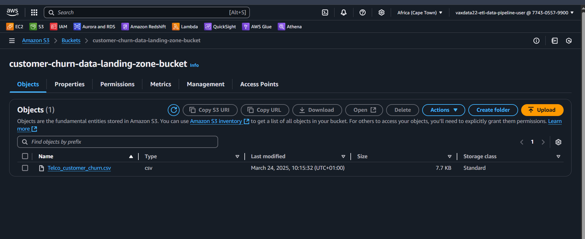

# Customer Churn end-to-end Analytics ETL Pipeline by Airflow on EC2
This is an end-to-end AWS Cloud ETL project. This data pipeline orchestration uses Apache Airflow on AWS EC2 as well as AWS Glue. 
It demonstrates how to build ETL data pipeline that would perform data transformation using Glue job and crawler as well as loading into a Redshift cluster table. It also shows how to connect Amazon Athena to the Glue Data Catalog for SQL analytics.
The data would then be visualized using Microsoft Power BI.
<br><br>


<br><br>

## GENERAL OVERVIEW OF PROJECT
This is an end-to-end AWS Cloud ETL project. This is customer churn Python ETL data engineering project uses Apache Airflow and different AWS services.
This customer churn data engineering project demonstrates how to build and automate a Python ETL pipeline that would extract data from a kaggle data repository, use AWS Glue to load data from AWS S3 bucket into an Amazon Redshift data warehouse thereafter connect Power BI to the Redshift cluster to then visualize the data to obtain insights. 

The AWS Glue aspect involves using the Glue Crawler to crawl the S3 bucket to infer schemas and then create a data catalogue based on that. Amazon Athena can also be used to write SQL queries on top of the data catalogue to get insights from the raw data. The AWS Glue also helps in loading the crawled data onto the Redshift cluster. Apache Airflow would be used to orchestrate and automate this process.

Apache Airflow is an open-source platform used for orchestrating and scheduling workflows of tasks and data pipelines. This project will entirely be carried out on AWS cloud platform.

The project was inspired by Dr Yemi Olanipekun, whose tutorials benefitted me a lot.
<br><br>

The kaggle data source file is an XLSX file available here: 
https://www.kaggle.com/datasets/yeanzc/telco-customer-churn-ibm-dataset?resource=download
<br><br>

## PROJECT REQUIREMENTS
1. Fundamental knowledge of SQL, Python, CSV/JSON, AWS Cloud, Apache Airflow, DW & ETL concepts
   
2. Familiarity with fundamentals Amazon Redshift data warehouse and Amazon Athena analytics
   
3. Knowledge of AWS Glue components such as the Crawler, Data Catalog, Glue job, database, etc
   
4. The Telco Customer Churn IBM Dataset (to serve as the source of the customer churn data)
   
5. AWS EC2 instance with at least 4 GB memory (t3.medium) Ubuntu; and AWS S3 bucket as Data Lake
    
6. Code Editor (I used VSCode) for connecting to EC2 instance to create code (DAG file) on Airflow
    
7. Apache Airflow for orchestration (authoring of the ETL workflow via DAG) & services connections
    
8. Good knowledge and skills in data analytics and visualization on Microsoft Power BI tool
    
9. Perseverance to troubleshoot and resolve errors and failures, read logs, rebuild components, etc
<br><br>

## STEPS OF THE WORKFLOW
The following account of the project development process may not enough be to enable the reader code along or replicate the whole process from start to finish. For instance, there is no detailing of the steps involved in creating account with Amazon AWS. There is also no detailing of the steps in creating an IAM User and creating the required IAM Roles that would later be used by EC2 and Glue, setting up the S3 buckets, deploying the Glue crawler and Glue job along with their IAM Role, connecting Athena to Glue Data Catalog, setting up Redshift data warehouse cluster and connecting Power BI to it, spinning up the AWS EC2 instance from scratch and preparing it to work with Airflow (Firewall settings for HTTP/HTTPS/SSH and attaching the IAM Role), connecting VSCode to the EC2 instance, as well as accessing Airflow via web browser.

However a person who is knowledgeable in Data Engineering skills should be familiar with how these are set up. By the way the reader who is not knowledgeable in these areas is hereby encouraged to do their own research, enroll in a Data Engineering bootcamp or learn from data engineering tutorials available online on some websites or some great channels on YouTube  (such as Tuple Spectra), or reach out to me for clarification. With that out of the way, let’s go over the key steps in this project.

Having satisfied all the 9 requirements in the preceding section, I proceeded to carry out the following setup:
<br><br>

### STEP 1: S3 buckets set up:
Two buckets would be needed for this project:

* Landing zone (data lake) bucket: `customer-churn-data-landing-zone-bucket`

* Athena queries result bucket: `customer-churn-athena-analytics-bucket`


<br><br>


<br><br>


<br><br>

A test data CSV file was uploaded into the landing zone bucket. This file has the same structure (table schema) as the data files that would be extracted from the data source and dumped here. 
However the purpose of uploading this “test data” file here is to allow the Glue crawler to infer the schema of the source data and create important schema metadata that would be used later in the Glue job ETL process. 
Access the test data CSV file [here](test_data/Telco_customer_churn.csv).


<br><br>

### STEP 2: IAM Roles for Amazon EC2 and AWS Glue:
Created two IAM roles, one for EC2 and the other for Glue:

#### EC2 role name: `ec2-access-to-s3-glue-redshift-role`
•	Details: AWS Service, Use case is EC2

•	Permissions:
o	`AmazonS3FullAccess`

o	`AWSGlueServiceRole` (for Glue crawler)

o	`AWSGlueConsoleFullAccess` (for Glue connection)

o	`AmazonRedshiftFullAccess`

o	`CloudWatchLogsFullAccess`

o	`AmazonEC2FullAccess`


<br><br>

#### Glue role name: `aws-glue-access-to-s3-and-redshift-role`
•	Details: AWS Service, Use case is Glue

•	Permissions:
o	`AmazonS3FullAccess`

o	`AWSGlueServiceRole` (for Glue crawler)

o	`AWSGlueConsoleFullAccess` (for Glue connection)

o	`SecretsManagerReadWrite`

o	`CloudWatchLogsFullAccess`


<br><br>

### STEP 3: AWS Redshift set up:

* Cluster name: `customer-churn-etl-data-warehouse`

* Details: Free trial, dc2.large, 1 node

* Admin User name: `customer-churn`

* Password: <REDSHIFT PASSWORD>

* Endpoint: `customer-churn-etl-data-warehouse.dfh8klfds3bn.af-south-1.redshift.amazonaws.com`

* Port: 5439

* Database: `dev`

* Schema: `public`

* Publicly accessible: Turned on (for Power BI Desktop connection)


<br><br>

Created the destination table “customer_churn” in the data warehouse:
```
CREATE TABLE IF NOT EXISTS customer_churn (
   CustomerID VARCHAR(255),
   City VARCHAR(255),
   Zip_Code INTEGER,
   Gender VARCHAR(255), 
   Senior_Citizen VARCHAR(255),
   Partner VARCHAR(255),
   Dependents VARCHAR(255), 
   Tenure_Months INTEGER,
   Phone_Service VARCHAR(255),
   Multiple_Lines VARCHAR(255),
   Internet_Service VARCHAR(255),
   Online_Security VARCHAR(255),
   Online_Backup VARCHAR(255), 
   Device_Protection VARCHAR(255),
   Tech_Support VARCHAR(255),
   Streaming_TV VARCHAR(255),
   Streaming_Movies VARCHAR(255),
   Contract VARCHAR(255),
   Paperless_Billing VARCHAR(255),
   Payment_Method VARCHAR(255),
   monthly_charges FLOAT,
   Total_Charges FLOAT,
   Churn_Label VARCHAR(255),
   Churn_Value INTEGER,
   Churn_Score INTEGER,
   Churn_Reason TEXT
);
```


<br><br>

The table is empty.


<br><br>

NB: Added a self-referencing rule in Redshift’s Security Group with the following details:
Type=All TCP, Custom, Redshift’s Security Group as source.
This very Security Group must already have an inbound rule set to:
Type=Redshift, Custom, Anywhere IPv4 as source.
<br><br>

### STEP 4: Created the Glue crawler database location:
This is where the crawler would store the metadata obtained from the S3 files.

Name: `customer-churn-s3-glue-database`


<br><br>

The crawler database is empty for now.


<br><br>

### STEP 5: Created the crawler to crawl the landing zone S3 bucket:
This was used to crawl the S3 data lake and infer the schema of the test data CSV file.

* Name: `s3-glue-crawler`

* Parameters: Crawl new folders only (Re-crawl new only)

* IAM Role: `aws-glue-access-to-s3-and-redshift-role`

* Target database: `customer-churn-s3-glue-database`

* Crawler schedule: On demand


<br><br>

The crawler was then run successfully.


<br><br>


<br><br>

The crawler database now contains a table created by the crawler for metadata.


<br><br>


<br><br>


<br><br>

The contents of the crawler database table indicating 33 columns in the dataset.


<br><br>

### STEP 6: Created the following 4 endpoints for Glue access:
In order to ensure successful creation of the Glue connection and Glue job, the following 4 endpoints are required in the VPC:

#### Name: `s3-gateway-endpoint-for-glue-access`

•	Services: `com.amazonaws.af-south-1.s3` (Gateway)

•	VPC: <The VPC that contains Redshift>

•	Route tables: <The route table used for Redshift>

•	Policy: Full access

#### Name: `redshift-interface-endpoint-for-glue-access`

•	Services: `com.amazonaws.af-south-1.redshift-data` (Interface)

•	VPC: <The VPC that contains Redshift>

•	Parameters: All subnets with their subnet IDs and all Security Groups

•	Policy: Full access

#### Name: `sts-interface-endpoint-for-glue-access`

•	Services: `com.amazonaws.af-south-1.sts` (Interface)

•	VPC: <The VPC that contains Redshift>

•	Parameters: All subnets with their subnet IDs and all Security Groups

•	Policy: Full access

#### Name: `secretsmanager-interface-endpoint-for-glue-access`

•	Services: `com.amazonaws.af-south-1.secretsmanager` (Interface)

•	VPC: <The VPC that contains Redshift>

•	Parameters: All subnets with their subnet IDs and all Security Groups

•	Policy: Full access


<br><br>

### STEP 7: Created a connection for Glue to access Redshift:
This is necessary for Glue to be able to load data into the Redshift cluster.

* Data source: Amazon Redshift (connect to Redshift)

* Database instance: `customer-churn-etl-data-warehouse`

* IAM Role: `aws-glue-access-to-s3-and-redshift-role`

* Name: `glue-connection-to-redshift`


<br><br>


<br><br>


<br><br>


<br><br>

### STEP 8: Created a Glue ETL job and ran the job:
This would handle the data transformation and loading into Redshift data warehouse.

Name: `s3-load-to-redshift-etl-glue-job`

#### Sources: AWS Glue Data Catalog
•	Database: `customer-churn-s3-glue-database`

•	Table: <selected the table created by the crawler earlier on>

#### Transforms: Change Schema
•	Set the following columns Target keys to their appropriate Data types:
    o	CustomerID string,
    
    o	City string,
    
    o	Zip_Code INT,
    
    o	Gender string, 
    
    o	Senior_Citizen string,
    
    o	Partner string,
    
    o	Dependents string, 
    
    o	Tenure_Months INT,
    
    o	Phone_Service string,
    
    o	Multiple_Lines string,
    
    o	Internet_Service string,
    
    o	Online_Security string,
    
    o	Online_Backup string, 
    
    o	Device_Protection string,
    
    o	Tech_Support string,
    
    o	Streaming_TV string,
    
    o	Streaming_Movies string,
    
    o	Contract string,
    
    o	Paperless_Billing string,
    
    o	Payment_Method string,
    
    o	monthly_charges FLOAT,
    
    o	Total_Charges FLOAT,
    
    o	Churn_Label string,
    
    o	Churn_Value INT,
    
    o	Churn_Score INT,
    
    o	Churn_Reason string
    
•	Dropped all other columns from the table schema

#### Targets: Amazon Redshift
•	Redshift access type: Direct data connection

•	Connection: `glue-connection-to-redshift`

•	Schema: `public`

•	Table: `customer_churn`

•	Handling: APPEND

•	S3 staging directory: `s3://aws-glue-assets-XXXXXXXXXXXX-af-south-1`

•	IAM Role: `aws-glue-access-to-s3-and-redshift-role`


<br><br>

The script generated for the Glue job was then downloaded. See the Python script for the Glue job [here](codes/s3-load-to-redshift-etl-glue-job.py).

Ran the Glue job successfully.


<br><br>


<br><br>

The destination table in Redshift was found to contain data. This confirms that the Glue job was able to load data into Redshift cluster.


<br><br>

The ETL staging area is a separate S3 bucket created by the Glue job.


<br><br>

### STEP 9: Successfully connected Amazon Athena to the Glue Catalog Data
This is to carry out, for instance, some SQL analytics on the raw data.

* Source: AWSDataCatalog

* Database: `customer-churn-s3-glue-database`

* Location of query results: `customer-churn-athena-analytics-bucket`


<br><br>

Previewed the Glue crawler metadata table.


<br><br>

Ran the following query on Athena as a proof of concept:
```
WITH churn_analysis AS (
    SELECT 
        "tenure months",
        "internet service",
        "payment method",
        "churn label",
        "churn reason",
        COUNT(*) AS total_customers,
        AVG("monthly charges") AS avg_monthly_charges,
        AVG("churn score") AS avg_churn_score
    FROM "customer-churn-s3-glue-database"."customer_churn_data_landing_zone_bucket"
    GROUP BY "tenure months", "internet service", "payment method", "churn label", "churn reason"
)
SELECT 
    "tenure months",
    "internet service",
    "payment method",
    "churn label",
    "churn reason",
    total_customers,
    avg_monthly_charges,
    avg_churn_score,
    RANK() OVER (PARTITION BY "churn label" ORDER BY total_customers DESC) AS churn_rank
FROM churn_analysis
ORDER BY "churn label" DESC, total_customers DESC;
```


<br><br>

Results of the query.


<br><br>

Checked the contents of the S3 buckets created for storing the results of queries on Athena.


<br><br>

### STEP 10: Connected Power BI Desktop to Redshift:
This is for the purpose of data visualization, dashboards, and reporting.


<br><br>

* Server: `customer-churn-etl-data-warehouse.dfh8klfds3bn.af-south-1.redshift.amazonaws.com`

* Database: `dev`
  

<br><br>

* User name: `customer-churn`

* Password: <REDSHIFT PASSWORD>


<br><br>

The connection to the remote data warehouse was successful.
<br><br>


<br><br>

Loaded the destination table data into Power BI.


<br><br>

Connected to the data via Direct Query.

<br><br>

### STEP 11: Provisioning the EC2 instance and authoring the DAG:
The EC2 instance `customer-churn-etl-pipeline-computer` was set up to allow SSH/HTTP/HTTPS and Custom TCP from any IPv4 on port 8080 (Apache Airflow). Attached to it was the `ec2-access-to-s3-glue-redshift-role` IAM Role for EC2 (created earlier on) for access to S3, Glue, and Redshift.


<br><br>


<br><br>

These required dependencies were then installed on EC2 for this project:

#### Update package list
```
sudo apt update
```
#### Install system dependencies
```
sudo apt install python3-pip python3.12-venv unzip
```
#### Install necessary packages that would enable smooth installation of airflow-providers-amazon
```
sudo apt install -y libxml2-dev libxmlsec1-dev libxmlsec1-openssl pkg-config
```
#### Create and activate a virtual environment 
```
python3 -m venv customer_churn_etl_pipeline_venv
source customer_churn_etl_pipeline_venv/bin/activate 
```
#### Install Apache Airflow 
```
pip install apache-airflow
```
#### Install Airflow Amazon AWS provider (for S3)
```
pip install apache-airflow-providers-amazon
```
#### Install Kaggle API client
```
pip install kaggle kagglehub
```
#### Install Pandas for data processing
```
pip install pandas
```
#### Engine to handle XLSX file
```
pip install openpyxl
```
#### Install additional dependencies for handling CSV and JSON
```
pip install numpy boto3 requests
```
#### Installed AWS CLI (For S3 & IAM Role Management)
```
pip install --upgrade awscli
```
#### To run Airflow when needed in developer environment
```
airflow standalone
```
<br><br>

The DAG was written to orchestrate the workflow once every week. The DAG pulls records from the source kaggle file in batches of 2345 records and dumps as CSV file in the landing zone S3 bucket. This simulates how data would be ingested in batches in a regular cadence. See the finished DAG file [here](codes/customer_churn_etl_dag.py).


<br><br>

This orchestration made use of a necessary AWS Airflow connection which was added via the Airflow GUI:
* Connection ID: `aws_new_conn`

* Connection Type: `Amazon Web Services`

* AWS Access Key: THE IAM USER ACCESS KEY

* AWS Secret Access Key: THE IAM USER SECRET ACCESS KEY
        Extra: {
           "region_name": "af-south-1"
        }
<br><br>

### STEP 12: Preparation before testing the orchestration, and triggering the DAG:
Following the success of the Glue job (which was able to transform the CSV file in the landing zone S3 bucket and load it into Redshift), preparation was made for testing the end-to-end orchestration. 

The preparation included deleting the first CSV file from the landing zone S3 bucket so that it contained no file, as well as dropping and re-creating the Redshift table so that it contained no data.


<br><br>

The destination table in the Redshift cluster was reset (dropped and re-created so that it is empty).


<br><br>

#### First successful run of the orchestration DAG.


<br><br>

The landing zone bucket now has one CSV file dumped there.


<br><br>

The details of the Glue ETL job run.


<br><br>

The destination table in Redshift now contains data. This was the first 2345 records.


<br><br>


<br><br>

The data in Redshift was then visualized using the connected Power BI.


<br><br>

#### The DAG was triggered again for another successful run.


<br><br>

The landing zone bucket now contains two files.


<br><br>

The Glue job run details.


<br><br>

The table in Redshift now contains 7035 records. This is because the crawler the second time around had to crawl both CSV files each containing 2345 rows in addition to the 2345 records in the Data Catalog.


<br><br>

#### The DAG was triggered a third time.


<br><br>

Landing zone now contained 3 files.


<br><br>

The Glue job run details.


<br><br>

The table in Redshift now has 14070 records. This means data from the 3 files crawled plus the 7035 records in the Data Catalog.


<br><br>

The updated visualization on Power BI is obtained by clicking the “Refresh” button on the toolbar.


<br><br>

See the Power BI file project file [here](powerbi_viz/customer_churn_viz.pbix).
<br><br>

## CHALLENGES AND FINAL THOUGHTS
The only notable challenge I had was in creating the Glue connection. And this was a problem because it required the appropriate set of permissions in the IAM Role, the correct VPC and Security Group settings, as well as the correct set of endpoints to be configured. I used a least-privilege approach where I added the privileges and endpoints increasingly until there were sufficient privileges and endpoint configurations to create the Glue connection.

It is observed that the second time the ETL orchestration was run, duplicate record of 2345 rows was loaded into Redshift. Similarly in the third run, duplicate record of 7035 rows was again loaded into Redshift. This was because the APPEND method was used by AWS Glue job in loading data into the Redshift table. To avoid duplicates, the MERGE (or TRUNCATE) method should be used.

I am thankful to Dr. Opeyemi ‘Yemi’ Olanipekun for inspiring me to carry out this project. His passionate way of teaching and guidance is second to none.
<br><br>

## RESOURCES TO LOOK THROUGH
https://airflow.apache.org/docs/apache-airflow/1.10.1/scheduler.html

https://airflow.apache.org/docs/apache-airflow-providers-amazon/stable/_api/airflow/providers/amazon/aws/sensors/glue/index.html

https://registry.astronomer.io/providers/amazon/versions/latest/modules/gluejobsensor

https://www.microsoft.com/en-US/download/details.aspx?id=58494
<br><br>

Cover Image credited to Tuple Spectra channel on Youtube.

### Thank you for going through this project with me!

